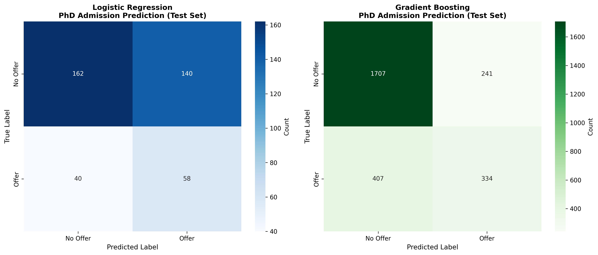

# Analysis of Economics PhD Admissions via Urch Forum (2010-2025)

## 1. Project Goal

The goal of this project is to collect text data from the Urch Economics PhD Forum to create a structured dataset and analyze admissions trends for Economics PhD admissions over 2010-2025. It is widely understood that certain quantitative metrics (such as GRE, GPA, years of experience, etc.) are primary determinants of admission, but there is still a lot of ambiguity on the exact measures PhD aspirants must take to be placed into a program. The primary goal of this project is to leverage Generative AI tools, SQL databases, and Machine Learning to extract structured applicant profiles from thousands of forum posts and identify correlations between applicant background and admission outcomes.

The key research questions are:

- **What are "strong cutoffs" for GRE Quant scores and GPA across different tiers of PhD programs?**

- **How important is having a "Math Background" (e.g., Real Analysis, Linear Algebra, and Calculus classes) for successful admission?**

- **Can Machine Learning models accurately predict the probability of receiving a PhD offer and the relevant ranking of the offer based on self-reported stats?**

---

##  2. Data Source and Collection
### Data Source
The data for this project was directly scraped from the **Urch Economics PhD Forum**. This is a public discussion board where applicants historically post their "profiles" (stats, math background, research experience) and subsequent results (acceptances/rejections).

### Data Collection Method

The data collection and processing followed a rigorous 7-stage workflow:

1.  **Web Scraping:** A custom Python script crawled the Urch Forum (ID 104) to extract thread titles, timestamps, and post content, collecting **130,000+ raw posts**.

2.  **Cloud Uploading:** The raw text data was uploaded into a **PostgreSQL database hosted on Google Cloud SQL** for scalable storage.

3.  **Dataset Filtering:** To minimize downstream API costs, we applied a rule-based filter (post length, keyword density, title info, content quality, etc.) to identify "Profile Evaluation" and "Results" posts. This reduced the dataset from **130,000 raw observations** to **18,500 high-signal posts** (85% noise reduction).

4.  **GPT Tools Call:** We utilized **OpenAI's GPT-4o-mini** with the Tools/Function Calling API to extract structured information (GPA, GRE Quant, School Lists) from the filtered text. This process ran via 10 concurrent async workflows over ~6 hours.

5.  **Cleaning and Feature Engineering:** We standardized the raw AI outputs into analytical features:
    * `undergrad_gpa_std`: Standardized diverse scales (10.0, 100%, 4.3) to a 4.0 scale.
    * `gre_quant_std` and `gre_verbal_std`: standardized GRE scores to account for old and new versions of the test.
    * `undergrad_rank` and `phd_accepted_rank`: Mapped institutions to **QS Economics Rankings 2025**.
    * `taken_real_analysis`/`taken_linear_algebra`/`taken_calculus`: Indicator variables for advanced math coursework.

### Data Dictionary
The final dataset (`admissions_data_cleaned.csv`) is organized with the following columns:
| Column                   | Description                                                                                                                      |
| ------------------------ | -------------------------------------------------------------------------------------------------------------------------------- |
| `undergrad_gpa_std`      | The applicant's GPA normalized to a 4.0 scale.                                                                                   |
| `attended_grad_program`  | A boolean flag (`1`/`0`) indicating whether the applicant attended a prior graduate program (e.g., Master's).                    |
| `taken_calculus`         | A boolean flag (`1`/`0`) indicating if the applicant took Calculus.                                                              |
| `taken_linear_algebra`   | A boolean flag (`1`/`0`) indicating if the applicant took Linear Algebra.                                                        |
| `taken_real_analysis`    | A boolean flag (`1`/`0`) indicating if the applicant took Real Analysis.                                                         |
| `gre_quant_std`          | GRE Quantitative section score (standardized to the current 130–170 scale).                                                      |
| `gre_verbal_std`         | GRE Verbal section score (standardized to the current 130–170 scale).                                                            |
| `undergrad_econ_related` | A boolean flag (`1`/`0`) indicating whether the undergraduate major is Economics or a closely related field.                     |
| `academic_lor`           | A boolean flag (`1`/`0`) indicating whether the applicant has at least one academic letter of recommendation.                    |
| `professional_lor`       | A boolean flag (`1`/`0`) indicating whether the applicant has at least one professional (non-academic) letter of recommendation. |
| `undergrad_rank`         | The tier of the applicant's undergraduate institution (1 = Top 10, 5 = Unranked).                                                |
| `got_phd_offer`          | A boolean target variable (`1`/`0`) indicating if the applicant received at least one PhD offer.                                 |
| `phd_accepted_rank`      | The tier of the highest-ranked PhD program the applicant was admitted to.                                                        |

### Limitations of the Data

* **Self-Selection Bias:** Successful applicants with high stats are more likely to post their results than those who were rejected everywhere, potentially skewing the data upwards.
* **Sparsity:** Despite filtering, many posts contain incomplete profiles (e.g., listing GPA but not GRE), resulting in missing values for certain features.
* **Verification:** All data is self-reported and cannot be independently verified against official university records.

---

## 3. Streamlit Visualization
We create a Python script that uses the Streamlit visualization platform to display and summarize the cleaned dataset for interpretation. Users can adjust multiple filters, sliders, and checkboxes to see how changing different feature variables affects the admission outcomes. Each filter adjustment triggers real-time SQL queries against the PostgreSQL database, instantly recalculating acceptance rates, placement distributions, and average statistics. 

The dashboard visualizes results through a combination of pie charts, tables, applicant counts, and detailed breakdowns of test scores/coursework. All calculations exclude null entries and compute proportions only from applicants with relevant data. This ensures accurate comparison of different credential combinations and their effects on admission outcomes.

## 34. Machine Learning Prediction
The analysis is conducted using Machine Learning models from sci-kit learn. Each model considers a 70-30 test-train split, cross-validation, and feature optimization using GridSearchCV. We consider two types of models for our analysis:

1. **Logistic Regression**: This probabilistic model uses all of the independent variables to estimate/predict the chances of getting a PhD offer. This model only considers observations with no missing values across all feature variables considered. That comes out to be 1332 observations, with about 25% having a positive outcome for the `got_phd_offer` outcome.
2. **Gradient Boosting**(`HistGradientBoostingClassifier`): This Machine Learning classifier works by combining many shallow decision trees. We use this model to expand the number of observations considered; Gradient Boosting natively supports missing values by learning rather than imputation. The optimal max depth was 7 when the outcome variable was admission chances (8961 observations) and 3 when the outcome was accepted PhD ranking (2080 observations).

### Model Performance Metrics
| Model | Dataset | Accuracy | Precision | Recall | F1-Score | AUC-ROC | MSE | MAE | R² |
|-------|---------|----------|-----------|--------|----------|---------|-----|-----|----|
| **Logistic Regression (Admission)** | Train | 0.5783 | 0.3233 | 0.6623 | 0.4345 | 0.6596 | - | - | - |
| **Logistic Regression (Admission)** | Test | 0.5500 | 0.2929 | 0.5918 | 0.3919 | 0.6157 | - | - | - |
| **Gradient Boosting (Admission)** | Train | 0.7658 | 0.5948 | 0.4734 | 0.5272 | 0.7651 | 0.2342 | 0.2342 | - |
| **Gradient Boosting (Admission)** | Test | 0.7590 | 0.5809 | 0.4507 | 0.5076 | 0.7297 | 0.2410 | 0.2410 | - |
| **Gradient Boosting (Tier)** | Train | - | - | - | - | - | 0.9690 | 0.8493 | 0.1190 |
| **Gradient Boosting (Tier)** | Test | - | - | - | - | - | 1.0695 | 0.9027 | 0.0640 |

 

### Confusion Matrices

### Logistic Regression coefficient estimates (Outcome: acceptance chance)

| Feature | Coefficient | Odds Ratio |
|---------|-------------|------------|
| **undergrad_gpa_std** | 0.5210 | 1.6837 | 
| **taken_real_analysis** | 0.3596 | 1.4328 |
| **academic_lor** | 0.2539 | 1.2890 |
| **professional_lor** | 0.2511 | 1.2854 |
| **attended_grad_program** | 0.1083 | 1.1144 |
| **taken_linear_algebra** | 0.0882 | 1.0922 |
| **gre_quant_std** | 0.0629 | 1.0649 |
| **gre_verbal_std** | 0.0354 | 1.0361 |
| **undergrad_rank** | 0.0245 | 1.0248 |
| **taken_calculus** | 0.0227 | 1.0229 |
| **undergrad_econ_related** | -0.0561 | 0.9454 |

### Gradient Boosting feature importance (Outcomes: acceptance chance and acceptance ranking)

| Feature | GB Admission | GB Tier |
|---------|--------------|---------|
| **attended_grad_program** | 0.0978 | 0.0320 |
| **undergrad_gpa_std** | 0.0288 | 0.0439 |
| **undergrad_rank** | 0.0135 | 0.0144 |
| **gre_quant_std** | -0.0019 | 0.0258 |
| **gre_verbal_std** | 0.0053 | 0.0225 |
| **academic_lor** | 0.0088 | 0.0023 |
| **professional_lor** | -0.0001 | -0.0009 |
| **taken_calculus** | 0.0058 | -0.0012 |
| **taken_linear_algebra** | -0.0004 | -0.0006 |
| **taken_real_analysis** | -0.0003 | 0.0002 |
| **undergrad_econ_related** | -0.0007 | 0.0072 |

### Limitations of the Analysis

* **Correlation vs. Causation:** We can observe that high GRE scores correlate with admission, but cannot control for unobserved variables like Letters of Recommendation (LORs), which are often the decisive factor.
* **Sample Size:** The number of "complete" profiles for the most recent year (2025) is small compared to historical years, as the cycle is ongoing.
* **Time-varying analysis:** The Machine Learning models work with cross-sectional data but do not use panel data across time. Therefore, results and effect sizes may be subject to some bias from varying trends in time.

---

## 4. Extensions and Future Research

* **Sentiment Analysis:** Future work could analyze the sentiment of "Statement of Purpose" advice threads to correlate writing style with success.
* **Letter of Recommendation Proxy:** We could refine the LLM extraction to search for mentions of "famous recommenders" to create a proxy variable for LOR quality.
* **Predictive Dashboard:** Deploy the trained model as a public web app where future applicants can input their stats to get a predicted probability range.
* **Time Series analysis** Use the GPT tools call to extract thread/post dates from raw data and conduct analysis on time-varying trends.

### Appendix

1.  Clone the repository.
2.  Install the required dependencies using requirements.txt.
3.  Run the code scraping.py to collect raw forum data. NOTE: Scraping the whole site has an approximate run time of 12 hours. You can adjust "start_page=" and "end_page=" for smaller sample sizes.

**You will need to create/add a .env file with PostgreSQL instance/database and GPT API key information to execute code from here onwards.**
5.  Run the code raw_data_upload.py to upload raw data to the Cloud SQL database.
6.  Run the code filtering.py in the folder Filtering to filter noise (130k -> 18.5k posts) and save as a new table in SQL.
7.  Run the code gpt_tools_call.py in the folder Tools Call to extract structured profiles via the OpenAI API. This will create another table in SQL with extracted results.
8.  Run the code cleaning.py in the folder cleaning-visualization to standardize and rank the data. This will create another table in SQL that is ready for visualization and analysis.
9.  Run visualization.py in the folder cleaning-visualization to view the interactive visualizations.
10. Run chances_gradientboosting.py and tier_gradientboosting.py in the folder Gradient Boosting and logistic_reg.py in the folder Logistic Regression to run all ML models and view performance metrics.
11. Run confusion_matrix.py in the folder plots to view the confusion matrices for admissions predictions as a heatmap.
